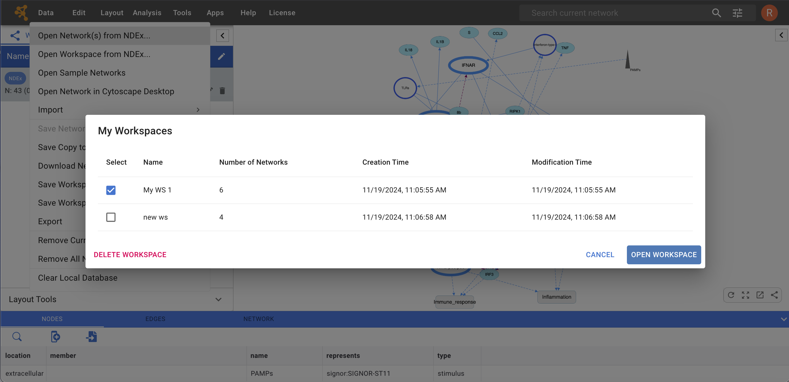

Creating Networks
====================

There are 2 different ways of creating networks in Cytoscape Web:

1.  Importing pre-existing networks from the [Network Data Exchange (NDEx)](https://www.ndexbio.org) public database.

2.  Importing pre-existing, unformatted text or Excel files.

## Import Network from NDEx

The NDEx Project provides an open-source framework 
where scientists and organizations can share, store, manipulate, and publish 
biological network knowledge.

To import a network from NDEx, choose **Data → Open network(s) from NDEx** in the top menu bar:

-   The **NDEx Network Browser** window will open in the **SEARCH NDEx** tab allowing you to browse all the available public networks sorted by date last modified.
  

-   You can find networks of interest by typing one or more search terms in the **search bar** (such as BRCA1, Apoptosis etc), and then clicking the  button to search.

-   *BONUS: If you are logged into your NDEx account, you can also select the **MY NETWORKS** tab and browse or search only among your own networks stored in NDEx.*

-   Search results are always returned in order of relevance based on the search terms you provided.

-   Networks highlighted in grey cannot be imported, mouse-over for more information.

-   On the left hand side, mark the checkbox to select the network(s) you want to import.

-   Click the **OPEN NETWORK(S)** button in the bottom right corner to import all selected networks.

## Import Workspace from NDEx

In Cytoscape Web, the worspace is comparable to the "session" concept in the Cytoscape desktop application.
Therefore, a Cytoscape Web workspace can be imported and exported to a user's NDEx account.
This feature is only available to Cytoscape Web users when they are logged into their NDEx accounts.

To import a workspace from NDEx, choose **Data → Open workspace from NDEx...** in the top menu bar:

-   The **My Workspaces** window will open and display all the available workspaces stored in your NDEx account.

  
-   On the left hand side, mark the checkbox to select the workspace you want to import.

-   Click the **OPEN WORKSPACE** button in the bottom right corner to import the selected workspace.

-   You can also **DELETE** a selected workspace if desired.

## Import Network from File

Cytoscape Web supports the import of networks from delimited text files (.csv, .txt, .tsv) also commonly referred to as network table files.
Cytoscape Web can also import network files in CX2 JSON format (.cx2), wich is also the format used to store them in NDEx.

*HINT: CX2 JSON files can be generated by the **Cytoscape desktop application** for any networks using **File → Export → Network to File...**.*

To import a network from file, choose **Data → Import → Network from File...** in the toop menu bar.

An interactive GUI allows users to specify parsing options for specified
files. The screen provides a preview that shows how the file will be
parsed given the current configuration. As the configuration changes,
the preview updates automatically. In addition to specifying how the
file will be parsed, the user must also choose the columns that
represent the source and target nodes as well as an optional edge
interaction type. For detailed instructions, see Basic Operations below.

The following is a sample network table file:

<table cellspacing="0"  style="table-layout: fixed; dwidth: 700px">
<caption>Sample Network in Table</caption>
<tr> <th class="">source</th>     <th class="">target</th>     <th class="center">interaction</th>  <th class="center">boolean data</th>  <th class="center">string data</th>   <th class="center">floating point data</th> </tr>
<tr> <td class="">YJR022W</td>    <td class="">YNR053C</td>    <td class="center">pp</td>           <td class="center">TRUE </td>         <td class="center">abcd12371</td>     <td class="center">1.2344543</td>           </tr>
<tr> <td class="alt">YER116C</td> <td class="alt">YDL013W</td> <td class="alt center">pp</td>       <td class="alt center">TRUE </td>     <td class="alt center">abcd12372</td> <td class="alt center">1.2344543</td>       </tr>
<tr> <td class="">YNL307C</td>    <td class="">YAL038W</td>    <td class="center">pp</td>           <td class="center">FALSE</td>         <td class="center">abcd12373</td>     <td class="center">1.2344543</td>           </tr>
<tr> <td class="alt">YNL216W</td> <td class="alt">YCR012W</td> <td class="alt center">pd</td>       <td class="alt center">TRUE </td>     <td class="alt center">abcd12374</td> <td class="alt center">1.2344543</td>       </tr>
<tr> <td class="">YNL216W</td>    <td class="">YGR254W</td>    <td class="center">pd</td>           <td class="center">TRUE </td>         <td class="center">abcd12375</td>     <td class="center">1.2344543</td>           </tr>
</table>
 

The network table file should contain at least two columns for creating
network with edges. If the file has only one column, the created network
will not contain any edges. The interaction type is optional in this
format. Therefore, a minimal network table looks like the following:

<table cellspacing="0">
<caption style="width: 240px">Minimal Network Table</caption>
<tr> <th class="">source</th>     <th class="">target</th>     </tr>
<tr> <td class="">YJR022W</td>    <td class="">YNR053C</td>    </tr>
<tr> <td class="alt">YER116C</td> <td class="alt">YDL013W</td> </tr>
<tr> <td class="">YNL307C</td>    <td class="">YAL038W</td>    </tr>
<tr> <td class="alt">YNL216W</td> <td class="alt">YCR012W</td> </tr>
<tr> <td class="">YNL216W</td>    <td class="">YGR254W</td>    </tr>
</table>
 

One row in a network table file represents an edge and its edge data
columns. This means that a network file is considered a combination of
network data and edge attribute data columns. A table may contain columns that
aren't meant to be edge attribute data. In this case, you can choose not to import
those columns.

### Basic Operations

To import a network from a delimited text table, please follow these steps:

1.  Select **Data → Import → Network from File...** 

2.  Select a file in the file chooser dialog.

3.  Define the interaction parameters by specifying which columns of
    data contain the Source Interaction, Target Interaction, and
    Interaction Type. Clicking on the boxes underneath any column header will bring up the
    column editor interface for selecting source, interaction and target:

    

4.  (Optional)
    -   Define node and edge attribute columns, if applicable. Network table files can have node and edge
        attribute columns in addition to network data. In the screenshot above, the "Pubmed" 
        data column has been defined as an *Edge attribute* and its data type set to *Integer* 

    -   Enable/Disable Table Columns: You can enable/disable column data
        by selecting the  symbol in the
        column editor interface.

    -   Change Data Types: Cytoscape has a basic data type detection function that automatically
        suggests the column data type according to its entries. This can be overridden by selecting
        the appropriate data type in the column editor. For lists, a delimiter must also be specified
        (i.e., all cells in the column must use the same delimiter). The following column data types are supported:
        -   String
        -   Boolean (True/False)
        -   Integer
        -   Floating Point (double)
        -   List of (one of) String/Boolean/Integer/Floating Point

5.  Click the blue **Confirm** button in the bottom right corner to complete the process.

### Import a List of Nodes Without Edges

The table import feature supports lists of nodes without edges. If you
select only a source column, it creates a network without interactions.

### Advanced Settings

The **Advanced Settings** button allows you to:

-   Transfer first line as column names: Selecting this option will
    cause all edge columns to be named according to the first data entry
    in that column.

-   Start Import Row: Set which row of the table to begin importing
    data from. For example, if you want to skip the first 3 rows in the
    file, set 4 for this option.
