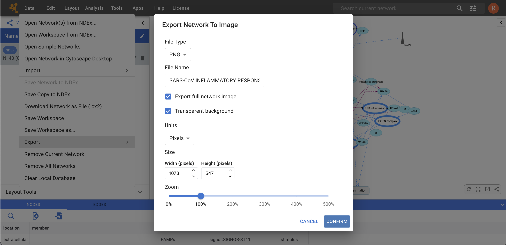

Exporting Your Data
====================

## Exporting Networks as Static Images
Cytoscape Web can generate publication-quality images from network views.

To export a network as image, select **Data → Export → Network to Image…**.
The **Export Network Image** dialog will open and look like the image below:

-    You can choose to export the current network view into the following formats: PNG, PDF or SVG.

-    The image export dialog has a variable number of options based on the file format selected, with **File Type**, **File Name** and  **Export full network image** always being selectable.
-    The PNG format has also options for scaling and background.
-    PDF has options for paper size.
-    Once you have selected the appropriate options, click **CONFIRM** in the bottom right corner of the dialog window.
-   Finally, choose the destination folder and save your network's image file.

The option to **Export full network image** is checked by default; if you uncheck this option, the exported image will only contain what is displayed in the Network View window. So, if you zoom in to display a portion of your network, the exported image will only contain that portion.

***NOTE: We recommend using PDF for publications because it is a standard vector graphics format, and it is easy to edit in other applications such as Adobe Illustrator.***

