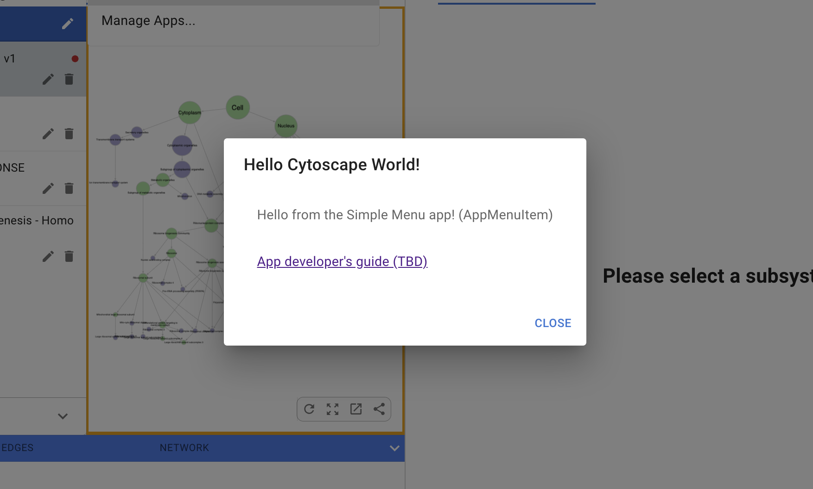
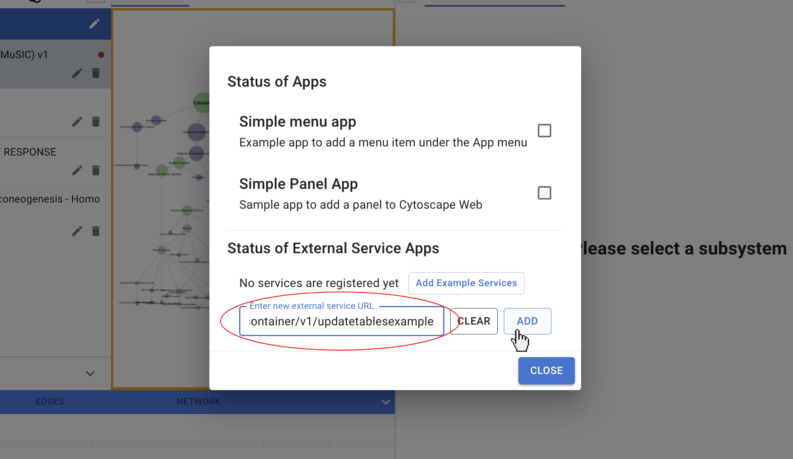

Extending Cytoscape Web
=========================
<a id="extending_cytoscape_web"> </a>

**Apps** and **Service Apps** are community built additions that add new functionality or extend existing capabilities of 
Cytoscape Web.

<a id="apps"> </a>
## Apps

Creating an **[App](Extending.md#writing_apps)** (written in Typescript) gives the developer the
most access to Cytoscape Web APIs to extend and augment both the user interface and analysis tools, but requires experience
in web development.

To enable/disable Apps in Cytoscape Web, choose **Apps -> Manage Apps** in the main menu and heck or uncheck the boxes in the **Status of Apps** section. For example,
checking the box next to **Simple Menu App** enables that example app. Once enabled, you will be able to use the App by choosing **Apps -> Simple Dialog Example** fromthe main menu. When you do so, a **Hello Cytoscape World!** window will pop up as shown below:



<a id="service_apps"> </a>
## Service Apps

The **[Service Apps](Extending.md#writing_service_apps)** are more limited in accessibility, but are easier
 to implement and offer freedom of language. 

To enable a Service App, paste its URL into the **Exterternal Service URL** field, and click **Add**. 



For example, if you paste in this URL: 

``
https://cd.ndexbio.org/cy/cytocontainer/v1/updatetablesexample
``

The **Update tables example** Service App will be enable in Cytoscape Web. To use it, choose **Apps -> Example Service App -> Update tables example**

Additional [example Service Apps](Extending.md#writing_service_apps) are available to test and familiarize with this feature.

**NOTE:** *All active Apps and Service Apps will be cleared if you reset Cytoscape Web by using **Data -> Clear Local Database**.*

<a id="community"></a>
## Community Available Service Apps

Here are all the community available Service Apps that can be registered and used in Cytoscape Web. Please refer to the paragraph on [Service Apps](Extending.md#service_apps) for detailed instructions.

**1. g:profiler Enrichment**

Analyze gene sets against biological databases to identify statistically significant pathways. **Requires** a network map with at least one data column (in the node table) containing a whitespace- or comma-separated list of gene symbols.
```
 https://cd.ndexbio.org/cy/cytocontainer/v1/gprofilerenrichment
```

**2. IQuery Enrichment**

Analyze gene sets against NDEx IQuery to retrieve pathways ranked by similarity-based matches. **Requires** a network map with at least one data column (in the node table) containing a whitespace- or comma-separated list of gene symbols.
```
    https://cd.ndexbio.org/cy/cytocontainer/v1/iqueryenrichment
```


<a id="developers"></a>
## For Developers

<a id="writing_apps"></a>
### Writing Apps
[Documentation to build an App](https://github.com/cytoscape/cytoscape-web-app-examples/tree/pre-release-cleanup)

For integration of a custom App into Cytoscape Web please [**contact us**](https://cytoscape.atlassian.net/servicedesk/customer/portal/1/group/1/create/7).

<a id="writing_service_apps"></a>
### Writing Service Apps
A Service App is a REST service that can be registered with Cytoscape Web to extend
functionality. For more information about creating a Service App see: [Cytoscape Web Service App REST service V1 specification](https://github.com/cytoscape/cytoscape-web/wiki/Specification-for-Service%E2%80%90based-App-in-Cytoscape-Web-(draft-v2))

Here are some example Service Apps to test or use as reference:

1. Add Network
```
https://cd.ndexbio.org/cy/cytocontainer/v1/addnetworksexample
```

2. Open URL
```
https://cd.ndexbio.org/cy/cytocontainer/v1/openurlexample
```

3. Update Layout
```
https://cd.ndexbio.org/cy/cytocontainer/v1/updatelayoutsexample
```

4. Update Network
```
https://cd.ndexbio.org/cy/cytocontainer/v1/updatenetworkexample
```

5. Update Selection
```
https://cd.ndexbio.org/cy/cytocontainer/v1/updateselectionexample
```
