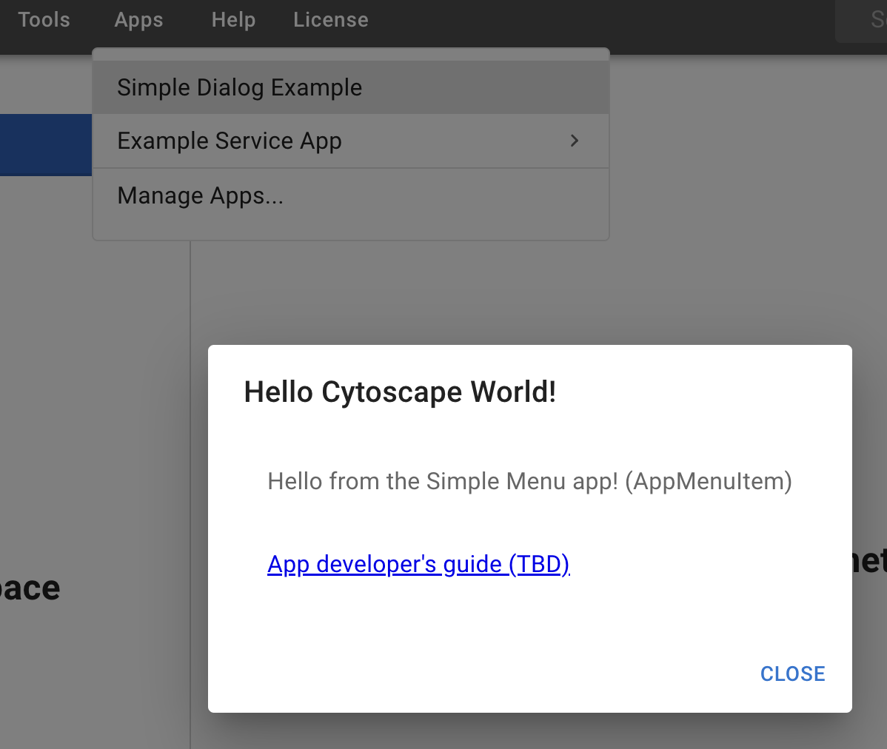

Extending Cytoscape Web
=========================

**Apps** and **Service-Apps** are community built additions that add new functionality to 
Cytoscape Web. 

 Writing an **[App](Advanced#app)** (written in Typescript) gives the developer the
most access to Cytoscape Web APIs and user interface to extend
or augment the interface and analysis tools, but requires comfort
in web development.

The **[Service-Apps](Advanced#service_app)** are more limited in accessibility, but are easier
 to implement and offer freedom of language. 

To enable/disable apps in Cytoscape Web, open the **Manage Apps...** menu item. In the 
**Manage Apps...** window, check or uncheck the boxes in the **Status of Apps** section. For example,
checking the box next to **Simple Menu App** enables that example app. Once enabled, you will see a 
new menu item called **Simple Dialog Example** under the **Apps** menu. When you click it, a **Hello Cytoscape World!**
window will pop up.

To enable a service app, paste its metadata URL into the **Exterternal Service URL** field, and click **Add**. For example,
if you paste in this URL: 

``
https://cd.ndexbio.org/cy/cytocontainer/v1/updatetablesexample
``

The **Update tables example** service app will be enable in Cytoscape Web. 

**NOTE:** The current app configuration will be cleared if you use the "Data"-> "Clear Local Database" function 
to completely reset the Cytoscape Web environment.

## App

[Documentation to build an App](https://github.com/cytoscape/cytoscape-web-app-examples/tree/pre-release-cleanup)

For integration of a custom App into Cytoscape Web please [**contact us**](https://cytoscape.atlassian.net/servicedesk/customer/portal/1/group/1/create/7).

## Service-App

A Service-App is a REST service that can be registered with Cytoscape Web to extend
functionality. For more information about creating a Service-App see:

[Cytoscape Web Service-App REST service V1 specification](https://github.com/cytoscape/cytoscape-web/wiki/Specification-for-Service%E2%80%90based-App-in-Cytoscape-Web-(draft-v2))

