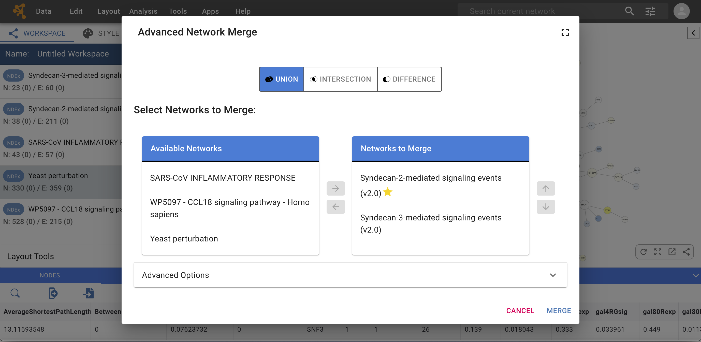
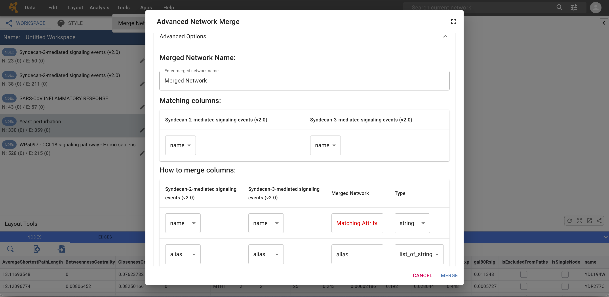

Merge
====================

## Merge Networks

Cytoscape Web allows for merging networks, through **Tools → Merge Networks**. The interface is very similar to that of the Cytoscape desktop application and will be familiar to Cytoscape users. 

### Basic Operations

-    With the buttons select either "UNION", "INTERSECTION" or "DIFFERENCE".

-    All the networks available to merge are listed under **Available Networks**.
     Select 2 or more networks from this list and click the right arrow to transfer
     them to **Networks to Merge**. The first network is marked with a yellow star and is the base network; the other network will 
     be merged into the base network.
     
-    Click **Merge** to continue. The merged network will be displayed as a new network in your workspace.

### Advanced Options

The **Advanced Network Merge** interface includes an expandable
**Advanced Options** panel, where you can specify the details of
how to merge the networks.

The options available here are:

-    **Merged Network Name**: here you can specify a custom name for the merged network.

-    **Matching columns**: this specifies the network columns that should
     be used for merging. Typically, the "name" column is used as matching attribute.
     Alternatively, you can decide to use a different column that contains some other type of identifier.

-    **How to merge columns**: a table lets the user specify for each of
     the individual network columns, what the corresponding column in the
     merged network should be named as well as its data type. Buttons Below the table,
     let you further customize how to merge columns for nodes, edges and network properties.

