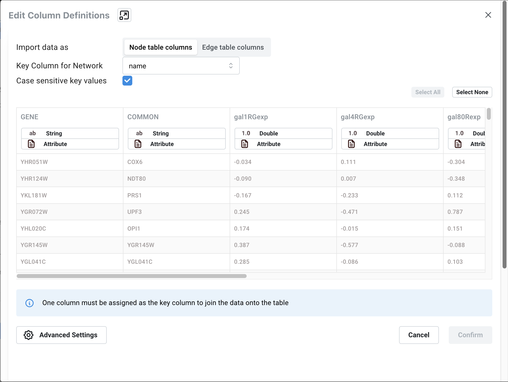
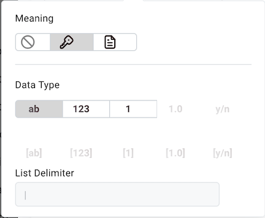
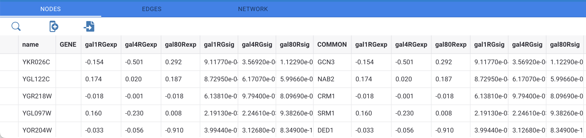

Node and Edge Column Data
========================================

Interaction networks are useful as stand-alone models but they are
most powerful for answering scientific questions when integrated with
additional information. Cytoscape Web allows the user to add arbitrary node,
edge and network information as node/edge/network column data. This could include, 
for example, annotation data on a gene or confidence values in a protein-protein 
interaction. These column data can then be visualized in a user-defined way by setting up a mapping
from columns to network attributes (colors, shapes, and so on). The
section on **[Styles](Styles.md#styles)** discusses this in greater detail.

## Import Data Table Files

Cytoscape Web offers support for importing data from delimited text data tables.

***Sample Data Table 1***

<table cellspacing="0" style="table-layout: fixed; dwidth: 500px">
<caption style="width: 500px">Sample Data</caption>
<tr> <th class="">GENE</th>  <th class="center">COMMON</th>        <th class="center">gal1RGexp</th>  <th class="center">gal1RGsig</th></tr>
<tr> <th class="spec">YHR051W</th>    <td class="">COX6</td>       <td class="">-0.034</td>    <td class="">0.37</td></tr> 
<tr> <th class="specalt">YHR124W</th> <td class="alt">NDT80</td>    <td class="alt">-0.09</td> <td class="">0.27</td></tr>
<tr> <th class="spec">YKL181W</th>    <td class="">PRS1</td> <td class="">-0.167</td>    <td class="">0.0062</td></tr>
</table>
 

The data table file should contain a primary key column and at least one
data column. The maximum number of data columns is unlimited, and the first row of
data can be used as column names. Alternatively, you can specify each column name
from the **Data → Import → Table from File...** interface.

### Basic Operation

1.  Load your network via **Data → Open network(s) from NDEx**, or **Import → Network from File** in the **Data** option of the **Menu Bar**.

2.  Select **Data → Import → Table from File...**.

2.  Select a data file in either .txt or .csv format.
    Alternatively, you can click the **Import Table from File...** button  in the **Table Panel**.

3.  The **Edit Column Definitions** interface will open:

4.  First, select where you want to import your data to under **Import data as**, either "Node table columns" or "Edge     table columns".

5.  Next, designate which column in your network contains the ++Key** to be used to map the network to the data under **Key Column for Network**. 

6.  To select a **Key** column in the data file, click on the column header, and click the key icon under **Meaning** in the pop-up interface. Make sure the column designated as key matches the key in the network.

7.  Similarly, to change the data type of a column, for example from 
    integer to string, click the column header and select the correct data type under **Data Type**.
    
8. A message at the bottom of the interface will inform you of how many rows of data will be imported to your network. Click **Confirm** to continue.
    
9.  The **Advanced Settings** allows you skip one or more of the first rows of data, and to specify if the first row contains column names.
    
8.  Click **Confirm** to import.

### Table Panel

When data has been imported, it is visible in the corresponding tab in the **Table Panel**:

-   Column data can be edited by double-clicking the cell. Once finished
editing, click outside of the editing cell in the **Table Panel** to save your edits. If you want to apply the same value to all rows in the column, select **APPLY VALUE TO COLUMN** at the top. Similarly, you can choose to apply your edits to all selected nodes by clicking **APPLY VALUE TO SELECTED NODES**. Pressing **Esc** while editing will undo any changes.
-   The data in the **Table Panel** can be searched, using the  button.
-   The columns in the **Table Panel** can be moved by clicking on the column header and dragging it to the desired location.
-   To select a node in the network corresponding to a row in the **Table Panel**, select the row and then click **SELECT NODES** at the top.
-   Rows in the panel can be sorted by specific column. To sort, click on a column heading and select the **Sort Ascending**  or **Sort Descending**  button. 
-   A new column can be created using the **Insert New column**

button. Columns can be deleted using the **Delete
Columns...**

button. This will remove the column from Cytoscape Web completely, not just
from the **Table Panel**.
-   Columns can be renamed by clicking on the **Rename column**  button and typing in a new name.
