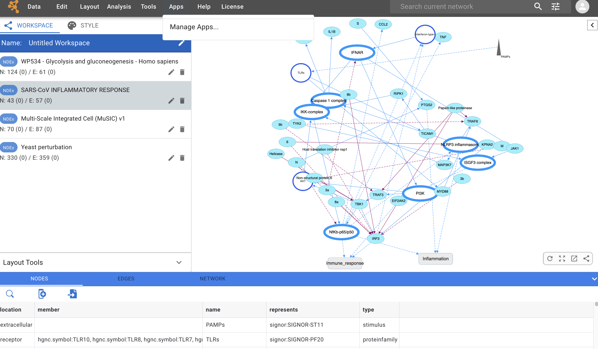
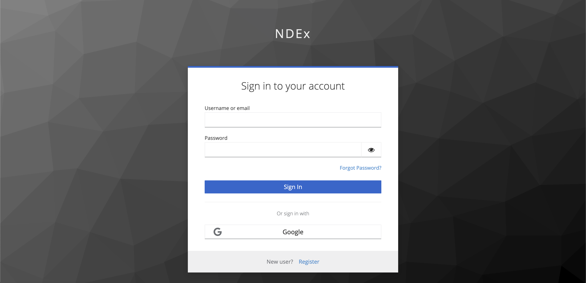
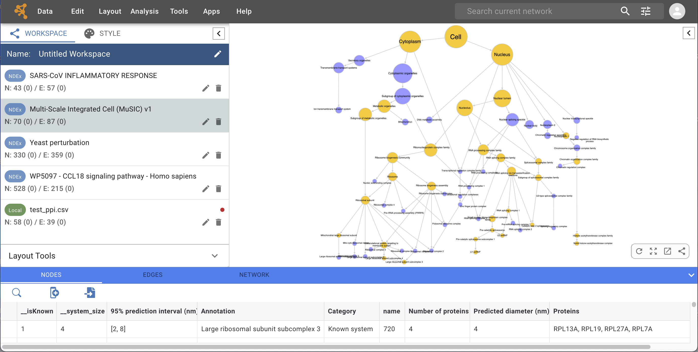
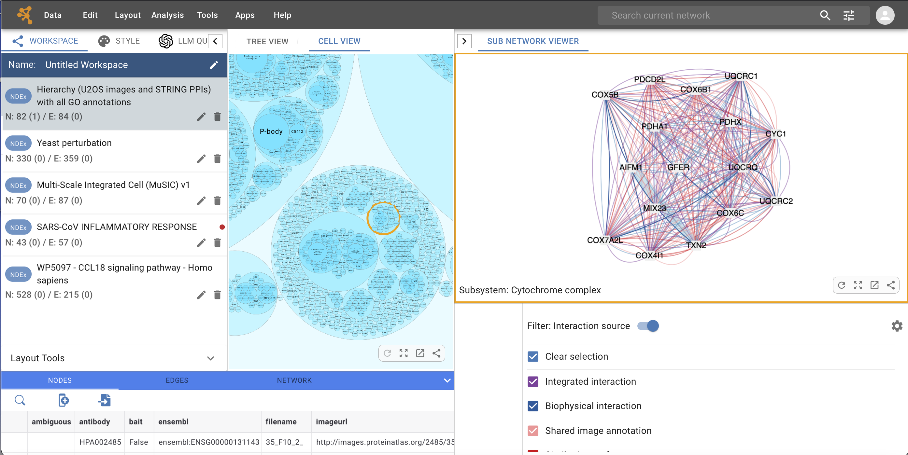

Quick Tour of Cytoscape Web
========================================

This chapter describes the basic layout and mechanics of using Cytoscape Web. When you start Cytoscape Web for the first time, the interface will look like the image below:

The interface layout is very similar to that of the Cytoscape desktop application, whith the **Control Panel** on the left, **Table Panel** at the bottom and **Network View Window** on the right.

When a network is loaded, Cytoscape Web will look similar to the image
below:

Most functionalities are self-explanatory, but we'll go through a
concise explanation of the interface components for clarity.

-   The **Menu Bar** is at the top of the screen and contains several options (see below for more information about
    each menu). Also in the Menu Bar, to the right, are the **Search Tool** and **NDEx Login** button.

-   The **Workspace Panel** (Workspace tab of the Control Panel). 
    This is where all the networks you are working with are listed.
    You can have several networks in your workspace, but only one of them can be selected and dispayed at any given time; this is called the 'current' network.
      
-   The **Network View** window displays the current network. At the bottom right corner
    of the network view are a set of network view tools, mouse over for more information on each tool. 

-   The full-width **Table Panel** uses the bottom portion of the screen and displays columns of data
    for nodes and edges in your network. The table also allows you to modify the values of
    column data.

The Workspace Panel and Table Panel can be resized according to your preference or even fully collapsed 
to maximize the screen space available for the Network View.

## The Menu Bar

### Data

As shown in the image below, the **Data** menu contains most basic file functionality:

   - **Data → Open** for opening NDEx networks and workspaces
   - **Data → Save** for saving networks and workspaces to NDEx 
   - **Data → Import** for importing data such as networks and tables
   - **Data → Export** for exporting data.

For more details, please review the chapters on **[Creating and Saving Networks](Creating_Networks.md#creating_networks)** and **[Exporting Your Data](Export_Your_Data.md#export_your_data)**.

### Edit

The **Edit** menu allows to delete the nodes and/or edges of a selected subset of
the network. Other editing options will be added in future releases.

### Layout

The **Layout** menu lists a variety of layout algorithms that can easily be applied to your network with just 1 click.
Choosing any of these options will lay the network out using the default settings for that algorithm. In this version of Cytoscape Web, the available options are:
-    DAGRE
-    Force-directed
-    Radial
-    Grid
-    Circle
-    COSE
-    Concentric
-    Cosmos

Choosing **Layout → Settings...** will open a dialog window where you can select each available layout algorithm to modify its parameters. You can also specify a default algorithm to use via the **Apply Default Layout** feature available in the Network View Window.
    

### Analysis

The **Analysis** menu contains features to analyze your networks.

**Run LLM Query** will analize a list of genes and provide details about their involvement in known biological processes. In this version of Cytoscape Web, the analysis is only available if your network is a hierarchical structure where its nodes are "communities" of genes. In future releases, the analysis will be extended to non-hierarchical networks too. Other analysis tools will also be added in future releases.

Choosing **Analysis → LLM Query Options** lets you select the LLM used for analysis, add your own API key as well as review and choose the prompt template to use. Currently, the available LLMs are OpenAi's *gpt-3.5-turbo* and *gpt-4-1106-preview*.

***NOTE: the **Run LLM Query** leverages commercially available LLMs and is therefore a paid feature. In order to use it, you must provide an API key linked to your OpenAI account so you can be billed based on usage. The API key is stored locally in your browser's cache, encrypted and only trasmitted to OpenAI via secure hyper text transfer protocol (https)***.

### Tools

The **Tools** menu contains advanced features like **[Network Merge](Merge.md#merge)**. Other advanced feature tools will be added in future releases. 

### Apps

The **Apps** menu allows to manage and configure apps and external services that extend Cytoscape Web capabilities. As apps and services are developed over time, they will become available through this menu.

### Help

The **Help** menu allows you to easily access basic information **About Cytoscape Web**, this **Manual**, the **Code Repository** and **Bug Report** interface. The **Citation** option displays the literature citation for
Cytoscape Web.

### Search Tool

The **Search Tool** lets you find elements within your network using text-based search. Click  in the **Search Tool** to reveal the search settings:

As shown in the image above, you can adjust the search settings by:

-    Selecting the type of boolean operator (*AND* or *OR*) to use.
-    Choosing the target (nodes only, edges only or both).
-    Selecting the search mode. The *Exact Match* option is used to enable/disable wildcard searches. When enabled, the results 
     will only contain the exact search term you specified.

Searches are ***case insensitive***; by default, they are performed on *nodes*, using the *OR* operator and *Exact match* enabled.

### Sign In Button

At the far right of the menu bar, the  icon allows you to sign in to your Network Data Exchange (NDEx) account (if you already have one) or register for one. Your NDEx accounts acts as the official "Cytoscape Ecosystem Account", and provides a secure, unified sign-in experience across existing and future Cytoscape ecosystem's applications and services.

Click  and the browser will open a new tab to display the NDEx sign in page as shown below:

Here, you can:

-    Sign in to your existing NDEx account either by typing your username and password, or by using the convenient *Sign In with Google* option.
  
-    Create a new NDEx account. Again, the easiest/fastest way is to click *Sign In with Google* to create a new account with just a few clicks. Alternatively, you can click *Register* at the bottom of the screen, provide the required information and follow the instructions to activate your new NDEx account.
 
***NOTE: even if you already have an exixting NDEx account, the first time you sign in to link your NDEx account with Cytoscape Web, you will need to go through an email verification process. While this is a quick and simple procedure, it is recommended that you perform it using the same browser and device.***

## Network Management

### Workspace

In Cytoscape Web, the **Workspace** replaces the **Session** concept that Cytoscape desktop application users are familiar with. 
The Cytoscape Web **Workspace** allows multiple networks to be loaded, but only one can be displayed at any given time. 

An example where a number of networks have been loaded is shown below:

The **Workspace Panel** (WORKSPACE tab in Control Panel) shows all the networks that are
loaded. Clicking on a network here will dispay the network in the **Network View** window.
Each network has a name, size (number of nodes and edges) and a label that identifies its provenance. 

If a network is loaded from NDEx, a  label is displayed in front of its name.
If the network is loaded from a file, the network name is the name of the file and a  label is displayed instead.

Some networks are very large and cannot be loaded in Cytoscape Web due to limitations in web browser's performance and capabilities:
-    For NDEx networks, the network size must be less than *500 Mb* and/or the nodes and edges count less than *20,000 elements*.
-    For networks imported from file, the text file must be less than *5 Mb*.

A **Workspace** can be saved to NDEx and re-opened later, via the options available in the **Data** menu. For more information, please review the chapter on **[Creating and Saving Networks](Creating_Networks.md#creating_networks)**.

### Style

The **Style Panel** (STYLE tab in Control Panel) also know as *VizMapper*, provides the interface to create and manage the visual styles associated with your networks.

As shown below, even though the look and feel of the **Style Panel** is consistent with that of the Cytoscape desktop application, we recommend you review the chapter on **[Styles](Styles.md#styles)** for detailed information and examples.

### Layout Tools

The **Layout Tools** panel is available below the **Workspace Panel**; this panel is collapsed by default and can be expanded
by clicking it. 

The **Layout Tools** let you adjust the *height* and *width* of the network either independently or together (both) by using an intuitive slider. The *circular arrow* button on the right resets the only the slider's position allowing additional adjustments.

## Network Viewer

### Network View

This is where your selected network is displayed and you can interact with it. At the bottom right corner of the **Network View** Panel is a set of 4 network view tools as shown below:

  **Apply Default Layout** will apply the default network layout (*G6: gForce*) or whatever other layout you have specified as "default" in the **[Layout Settings](Quick_Tour_of_Cytoscape.md#layout)**.

  **Fit Network to Window** will resize the current network and fit it to the **Network View** window.

  **Open in Cytoscape** will open the current network in the Cytoscape desktop application if it is already running on your computer (default port: 1234).

  **Share Network** copies the URL of the current network to your computer's clipboard so you can paste it in emails and other documents.

### Cell View

If the currently selected network is a *hierarchy*, the interface will display the **Cell View** tab at the top of the **Network View** panel. Click it to switch to the **Cell View**, also know as circle packing view:

**Cell View** displays the network in systems (circles) that might or might not be nested.
A fair comparison is to think about this type of representation as Matryoshka dolls.

Single click a system to select it. Double click it to zoom in and see the next-level systems (sub-systems).

When a system is selected, you can explore the underlying interaction network in the **Sub Network Viewer** panel:

The **Sub Network Viewer** panel can be opened and closed using the  button in the top right corner of the **Cell View** window.

When the hierarchical model has more than 1 interaction data sources, filtering options will be available in the bottom part of the **Sub Network Viewer** panel, allowing you to explore the different sources of data available for the selected system.

## Tables

### Table Panel

At the bottom of the interface, the **Table Panel** allows you to view and modify your network's data.

The **Table Panel** has a blue header with 3 tabs: **NODES**, **EDGES** and **NETWORK**, that contain the data columns (also known as *attributes* or *properties*) for each of those elements. The interface is the same for all 3 tabs, so we will only describe it in detail for the default table, the **NODES** table.

Like other interface features, the **Table Panel** can be minimized using the arrow button on the right hand side, or its size customized to user's preference by dragging the blue header up and down. The image below shows the a custom sized panel with the **NODES** tab selected.

Consistently with the behavior in the Cytoscape desktop application, when no nodes are selected in the network view, the **NODES** table shows the data columns and values of all nodes in the network.

When one or more nodes are selected in the network view, the *NODES* table only shows the data for the selected nodes.

Above the column headers, we find a number of **Table Tools**:

  Allows to perform text-based search within the data columns.
  
  Allows to add a new columns to the existing table. Users can specify the name of the column, the datatype and an optional default value to populate the column if desired.
  
  Allows to import another table to add new data columns to the current table. Please review the chapter on **[Node and Edge Column Data](Node_and_Edge_Column_Data.md#table_panel)** for detailed information and examples.

Any cells in the table can be selected and its values edited. Click the cell ***once*** to select it, click it ***again*** to edit its content. If the content of the cell is a link, click the ***pencil icon*** to edit it. Multiple cells can be selected by combining mouse clicks with either the *shift* or *command* buttons on the keyboard.

When one or more cells in the table are selected, additional **Table Tools** will become available as shown below:

-    *APPLY VALUE TO COLUMN* > Applies the value of the selected cell to all cells in that column.
-    *APPLY VALUE TO SELECTED NODES* > Applies the value of the selected cell to the cells of all nodes selected in the network view (if any).
  
   ***NOTE: These tools will modify your data and the changes are irreversible, please use them with caution.***

-    *SELECT NODES* > Selects (highlights) the node in the network view corresponding to the selected cell in the table.

