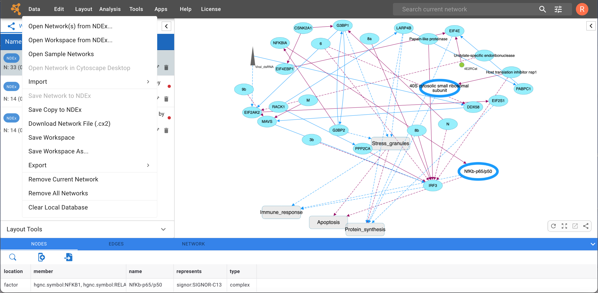

Quick Tour of Cytoscape Web
========================================

This chapter describes the basic layout and mechanics of using Cytoscape Web. When you start Cytoscape Web for the first time, the interface will look like the image below:

The interface layout is very similar to that of the Cytoscape desktop application, whith the **Control Panel** on the left, **Table Panel** at the bottom and **Network View Window** on the right.

When a network is loaded, Cytoscape Web will look similar to the image
below:

Most functionalities are self-explanatory, but we'll go through a
concise explanation of the interface components for clarity.

-   The **Menu Bar** is at the top of the screen and contains several options (see below for more information about
    each menu). Also in the Menu Bar, to the right, are the **Search Tool** and **NDEx Login** button.

-   The **Workspace Panel** (Workspace tab of the Control Panel). 
    This is where all the networks you are working with are listed.
    You can have several networks in your workspace, but only one of them can be selected and dispayed at any given time; this is called the 'current' network.
      
-   The **Network View Window**, which displays the current network. At the bottom right corner
    of the network view are a set of network view tools, mouse over for more information on each tool. 

-   The full-width **Table Panel** uses the bottom portion of the screen and displays columns of data
    for nodes and edges in your network. The table also allows you to modify the values of
    column data.

The Workspace Panel and Table Panel can be resized according to your preference or even fully collapsed 
to maximize the screen space available for the Network View Window.

## The Menus

### Data

The **Data** menu contains most basic file functionality: **Data → Open**
for opening NDEx networks and workspaces; **Data → Save** for saving networks and workspaces to NDEx; 
**Data → Import** for importing data such as networks and tables; and **Data → Export** for exporting data. 

Updated Data menu image goes here (quick_tour_3.pmg)

### Edit

The **Edit** menu allows to delete the nodes and/or edges of a selected subset of
the network.

Other editing options will be added in future releases.

### Layout

The **Layout** menu lists a variety of layout algorithms that can easily be applied to your network with just 1 click.
Choosing any of these options will lay the network out using the default settings for that algorithm. In this version of Cytoscape Web, the available options are:
-    DAGRE
-    Force-directed
-    Radial
-    Grid
-    Circle
-    COSE
-    Concentric
-    Cosmos

Choosing **Layout → Settings...** will open a dialog window where you can select each available layout algorithm to modify its parameters. You can also specify a default algorithm to use via the **Apply Default Layout** feature available in the Network View Window.
    

### Analysis

The **Analysis** menu contains features to analyze your networks. **Run LLM Query** will analize a list of genes and provide details about their involvement in known biological processes. In this version of Cytoscape Web, the analysis is only available if your network is a hierarchical structure where its nodes are "communities" of genes. In future releases, the analysis will be extended to non-hierarchical networks too. Other analysis tools will also be added in future releases.

Choosing **Analysis → LLM Query Options** lets you select the LLM used for analysis, add your own API key as well as review and choose the prompt template to use. Currently, the available LLMs are OpenAi's *gpt-3.5-turbo* and *gpt-4-1106-preview*.

***NOTE: the **Run LLM Query** leverages commercially available LLMs and is therefore a paid feature. In order to use it, you must provide an API key linked to your OpenAI account so you can be billed based on usage. The API key is stored locally in your browser's cache, encrypted and only trasmitted to OpenAI via secure hyper text transfer protocol (https)***.

START HERE >>>>

### Apps

The **Apps** menu gives you access to the **App Manager** (**Apps → App
Manager**) for managing (install/update/delete) your apps and may have
options added by apps that have been installed. Depending on which apps
are loaded, the apps that you see may be different than what appear
here. The below picture shows a Cytoscape installation without installed
apps.

**Note: A list of available Cytoscape apps with descriptions is available online at: [http://apps.cytoscape.org](http://apps.cytoscape.org)**

In previous versions of Cytoscape, apps were called plugins and served a
similar function.

### Tools

The **Tools** menu contains advanced features like **cyCharts**, **[Network Analyzer](Network_Analyzer.html#networkanalyzer)**, **[Cytoscape Web Browser](CyBrowser.html)**, **[Network Merge](Merge.html#merge)**, **[Execute Command File...](Command_Tool.html)**, **Job Status Monitor**, **Run Script File...** and **[Diffuse](Finding_and_Filtering_Nodes_and_Edges.html#diffusion)**.

**Cytoscape Web Browser** allows for viewing any html page directly in Cytoscape. The web browser can be opened in a separate window or can be launched in the Results Panel. 

### Help

The **Help** menu allows you to launch the online help viewer and browse and search this manual.
It also provides direct access to a **Tour of Cytoscape**, as well as a full listing
of Cytoscape tutorials. Tutorial content opens automatically in the **Cytoscape Web Browser**. 
Video demos are also linked to direclty from the Help menu. 

The **Citations** option displays the main literature citation for
Cytoscape, as well as a list of literature citations for installed apps.
The list will be different depending on the set of apps you have
installed.

The **Help** menu also allows you to connect directly to Cytoscape Help
Desk and the Bug Report interface.

## Network Management

Cytoscape allows multiple networks to be loaded at a time, either with
or without a view. A network stores all the nodes and edges that are
loaded by the user and a view displays them.

An example where a number of networks have been loaded is shown below:

The network manager (in Control Panel) shows the networks that are
loaded. Clicking on a network here will make that view active in the
main window, if the view exists. Each network has a name and size
(number of nodes and edges), which are shown in the network manager. If
a network is loaded from a file, the network name is the name of the
file.

Some networks are very large (thousands of nodes and edges) and can take
a long time to display. For this reason, a network in Cytoscape may not
contain a "view". Networks that have a view are in normal black font and
networks that don't have a view are highlighted in red. You can create
or destroy a view for a network by right-clicking the network name in
the network manager or by choosing the appropriate option in the
**Edit** menu. You can also destroy previously loaded networks this way.

Certain operations in Cytoscape will create new networks. If a new
network is created from an old network, for example by selecting a set
of nodes in one network and copying these nodes to a new network (via
the **File → New Network** option), it will be shown immediately
follows the network that it was derived from.

Network views can also be detached (undocked) from the main Cytoscape window. When detached, a view window can be dragged to another monitor, resized, maximized and minimized by using the normal window controls for your operating system. Notice, however, that closing a view window does not destroy it, but simply reattaches it to the Cytoscape window.

### Arrange Network Windows

When you have detached network view windows, you can arrange them by selecting one of these options under **View → Arrange Detatched Views**:

**Grid**

**Cascade**

**Vertical Stack**

**Side by Side**

## Network View Tools

At the bottom of the Network View Window is a set of network tools:

-   **Show Grid** will arrange all loaded networks as a grid.

-   **Show Network** will show the currently selected network.

-   **Detach View** detaches the network view window from the main Cytoscape window.

-   **Export to File...** gives you options to export the network or image.

-   **Always Show Graphics Detail** forces the rendering of graphics details. It is turned off by default.

-   **Toggle Node Selection** allows you to turn off/on node selection. It is turned on by default.
    
-   **Toggle Edge Selection** allows you to turn off/on edge selection. It is turned on by default.

-   **Toggle Annotation Selection** allows you to turn off/on annotation selection. It is turned off by default.

-   **Toggle Node Label Selection** allows you to turn off/on node label selection. It is turned off by default.

-   **Hide Navigator** lets you hide the Navigator ("bird's eye view").

The **Navigator** (or "bird's eye view") shows an overview of the network. It can be used to navigate around a large network view. The blue rectangle indicates the portion of the network currently displayed in the network view window, and it can be dragged with the mouse to view other portions of the network. Zooming in will cause the rectangle to appear smaller and vice versa. 

For information on user privacy, see the **[Cytoscape Web Privacy
Policy](Cytoscape_Privacy_Policy.html#cytoscape_web_privacy_policy)**.
