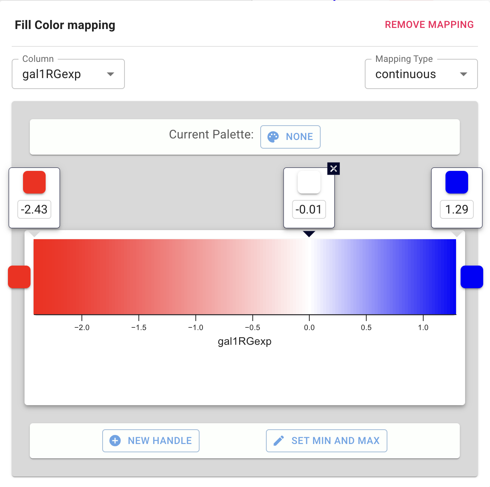
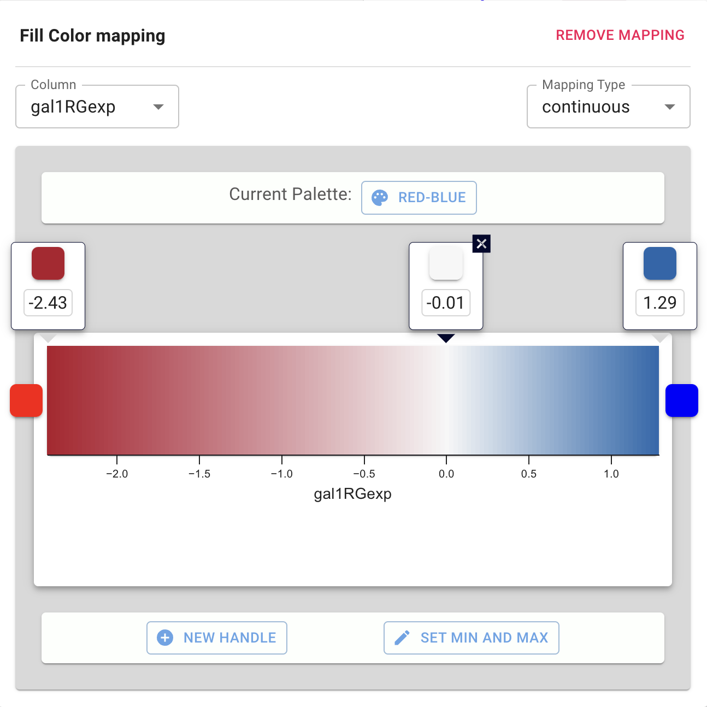

Styles
====================

## Introduction to the Style Interface

The style interface is located under the **STYLE** panel of the
**Network Panel**.

-   The interface is composed of three tabs, for **NODES**,
    **EDGES** and **NETWORK** properties.

-   Each tab contains a list of properties relevant to the
    current style. 

-   Each property entry in the list has 3 columns:

    -   The **Default** shows just that, the default value for
        the property. Clicking on the **Default** column for any
        property allows you to change the default value.

    -   **Mapping** displays the mapping currently in use for
        the property. Clicking on the **Mapping** column for any
        property opens an interface for
        defining the mapping. Details on the mapping types are provided
        [here](Styles.html#how-mappings-work).

    -   **Bypass** displays any style bypass for a selected node
        or edge. Note that a node/edge or subset of nodes/edges must be
        selected to activate the **Bypass** column. Clicking on the
        **Bypass** column for selected node(s)/edge(s) allows you to
        enter a bypass for that property for selected node(s)/edge(s).

The **Default Value** is used when no mapping is defined for a property,
or for nodes/edges not covered by a mapping for a particular property.
If a **Mapping** is defined for a property, this defines the style for
all or a subset of nodes/edges, depending on how the mapping is defined.
A **Bypass** on a specific set of nodes/edges will bypass and override
both the default value and defined mapping.

### List of Node, Edge and Network Properties

The style of a variety of properties to be controlled, summarized in the tables below.

<table cellspacing="0" style="table-layout: fixed; width: 700px">
<caption>Node Properties</caption>
<colgroup> <col style="width:200px">                              <col style="width:500px"> </colgroup>
<tbody>
<tr> <th>Node Property</th>                                     <th>Description</th></tr>
<tr> <th class="spec ulcase">Border Color</th>                    <td class="">The color of the border of the node.</td> </tr>
<tr> <th class="spec ulcase">Border Line Type</th>                <td class="">The type of line used for the border of the node.</td> </tr>
<tr> <th class="specalt ulcase">Border Opacity</th>          <td class="alt">The opacity of the color of the border of the node. <i>Zero</i> means totally transparent, and <i>255</i> means totally opaque.</td> </tr>
<tr> <th class="spec ulcase">Border Width</th>                    <td class="">The width of the node border.</td> </tr>
<tr> <th class="specalt ulcase">Fill Color</th>                   <td class="alt">The color of the node.</td> </tr>
<tr> <th class="spec ulcase">Height</th>                          <td class="">The height of the node. Height will be independent of width.</td> </tr>
<tr> <th class="specalt ulcase">Label</th>                        <td class="alt">The text used for the node label.</td> </tr>
<tr> <th class="spec ulcase">Label Color</th>                     <td class="">The color of the node label.</td> </tr>
<tr> <th class="spec ulcase">Label Font</th>                 <td class="">The font used for the node label.</td> </tr>
<tr> <th class="specalt ulcase">Label Font Size</th>              <td class="alt">The size of the font used for the node label.</td> </tr>
<tr> <th class="specalt ulcase">Label Opacity</th>           <td class="alt">The opacity of the node label. <i>Zero</i> means totally transparent, and <i>255</i> means totally opaque.</td> </tr>
<tr> <th class="spec ulcase">Label Position</th>                  <td class="">The position of the node label relative to the node.</td> </tr>
<tr> <th class="spec ulcase">Label Rotation</th>                  <td class="">The rotation of the node label, default is 0.</td> </tr>
<tr> <th class="spec ulcase">Label Width</th>                     <td class="">The maximum width of the node label.</td> </tr>
<tr> <th class="specalt ulcase">Opacity</th>                 <td class="alt">The opacity of the color of the node. <i>Zero</i> means totally transparent, and <i>255</i> means totally opaque.</td> </tr>
<tr> <th class="specalt ulcase">Selected Color</th>                 <td class="alt">The fill color of the node when selected.</td> </tr>
<tr> <th class="spec ulcase">Shape</th>                           <td class="">The shape of the node.</td> </tr>
<tr> <th class="specalt ulcase">Visibility</th>                   <td class="alt">Hides the node if set to false. By default, this value is set to true.</td> </tr>
<tr> <th class="specalt ulcase">Width</th>                        <td class="alt">The width of the node. Width will be independent of height.</td> </tr>
<tr> <th class="specalt ulcase">Z Order</th>                   <td class="alt">Z location of the node. Default value of this will be ignored. The value will be used only when mapping function is defined.</td> </tr>
</tbody>
</table>
 

<table cellspacing="0" style="table-layout: fixed; width: 700px">
<caption>Edge Properties</caption>
<colgroup> <col style="width:200px">                                <col style="width:500px"> </colgroup>
<tbody>
<tr> <th>Edge Property</th>                                       <th>Description</th></tr>
<tr> <th class="spec ulcase">Label</th>                             <td class="">The text used for the edge label.</td> </tr>
<tr> <th class="spec ulcase">Label Color</th>                       <td class="">The color of the edge label.</td> </tr>
<tr> <th class="specalt ulcase">Label Font</th>                <td class="alt">The font used for the edge label.</td> </tr>
<tr> <th class="spec ulcase">Label Font Size</th>                   <td class="">The size of the font used for the edge label.</td> </tr>
<tr> <th class="specalt ulcase">Label Opacity</th>             <td class="alt">The opacity of the color of the edge label. <i>Zero</i> means totally transparent, and <i>255</i> means totally opaque.</td> </tr>
<tr> <th class="specalt ulcase">Label Rotation</th>             <td class="alt">The rotation of the edge label, default is 0.</td> </tr>
<tr> <th class="specalt ulcase">Label Width</th>             <td class="alt">The width of the edge label.</td> </tr>
<tr> <th class="spec ulcase">Line Type</th>                         <td class="">The type of stoke used to render the line (solid, dashed, etc.)</td> </tr>
<tr> <th class="spec ulcase">Opacity</th>                      <td class="">The opacity of the of the edge. Zero means totally transparent, and 255 means totally opaque.</td> </tr>
<tr> <th class="spec ulcase">Selected Color</th>                  <td class="">The color of the whole edge (stroke and arrows) when selected. </td> </tr>
<tr> <th class="specalt ulcase">Source Arrow Color</th>  <td class="alt">The color of the arrow on the source node end of the edge.</td> </tr>
<tr> <th class="specalt ulcase">Source Arrow Shape</th>             <td class="alt">The shape of the arrow on the source node end of the edge.</td> </tr>
<tr> <th class="spec ulcase">Stroke Color</th>         <td class="">The color of the edge line.</td> </tr>
<tr> <th class="specalt ulcase">Target Arrow Color</th>  <td class="alt">The color of the arrow on the target node end of the edge.</td> </tr>
<tr> <th class="spec ulcase">Target Arrow Shape</th>                <td class="">The shape of the arrow on the target node end of the edge.</td> </tr>
<tr> <th class="specalt ulcase">Visible</th>                        <td class="alt">Hides the edge if set to <i>false</i>. By default, this value is set to <i>true</i>.</td> </tr>
<tr> <th class="spec ulcase">Width</th>                             <td class="">The width of the edge line.</td> </tr>
<tr> <th class="specalt ulcase">Source Arrow Selected Paint</th>    <td class="alt">The selected color of the arrow on the source node end of the edge.</td> </tr>
<tr> <th class="spec ulcase">Stroke Color (Selected)</th>           <td class="">The color of the edge line when selected.</td> </tr>
<tr> <th class="specalt ulcase">Target Arrow Selected Paint</th>    <td class="alt">The selected color of the arrow on the target node end of the edge.</td> </tr>
<tr> <th class="spec ulcase">Color (Unselected)</th>                <td class="">The color of the whole edge (stroke and arrows) when it is not selected.</td> </tr>
<tr> <th class="spec ulcase">Z Order</th>                <td class="">The ordering for overlapping edges. Edges with a lower value will be underneath edges with a higher value. Default value of this will be ignored. The value will be used only when mapping function is defined.</td> </tr>
</tbody>
</table>
 

<table cellspacing="0" style="table-layout: fixed; width: 700px">
<caption>Network Properties</caption>
<colgroup> <col style="width:200px">                    <col style="width:500px"> </colgroup>
<tbody>
<tr><th>Network Property</th>                        <th>Description</th></tr>
<tr><th class="spec ulcase">Background Color</th>       <td class="">The background color of the network view.</td></tr>
</tbody>
</table>
 

### How Mappings Work

For each property, you can specify a default value or define a dynamic
mapping. Cytoscape currently supports three different types of mappings:

1.  **Passthrough Mapping**

    -   The values of network column data are passed directly through
        to properties. A passthrough mapping is typically used to
        specify node/edge labels. For example, a passthrough mapping can
        label all nodes with their common gene names.

2.  **Discrete Mapping**

    -   Discrete column data are mapped to discrete properties. For
        example, a discrete mapping can map different types of molecules
        to different node shapes, such as rectangles for gene products
        and ellipses for metabolites.

3.  **Continuous Mapping**

    -   Continuous data are mapped to properties. Depending on the
        property, there are three kinds of continuous mapping:

        i.  **Continuous-to-Continuous Mapping**: for example, you can
            map a continuous numerical value to node size.

        ii. **Color Gradient Mapping**: This is a special case of
            continuous-to-continuous mapping. Continuous numerical
            values are mapped to a color gradient.

## Styles Tutorial

The following tutorial demonstrate some of the basic style features. 

### Creating a Basic Style with Discrete and Continuous Mappings

First, we will update the default values for two node properties:

1.  Load a sample network via **Data → Open network(s) from NDEx** in the top menu bar.
In the **NDEx Network Browser** window, search for **galfiltered** and open the **galFiltered network with data**.

2.  Select the **STYLE** panel in the Network Panel. Default values are defined for
some of the properties. 

3.  To set the default node shape to ovals, click the **Default** column for the
    **Shape** property in the **NODES** tab. Select the **ellipse** item and click **CONFIRM**. 
    
4.  Similarly, click the **Default** column for **Fill
    Color** and set it to light grey.

<!--    -->

Next, we will use discrete mappings for edge style properties:

5.  In the **EDGE** tab of the **STYLE** panel, find the
    **Stroke Color** property and click on the **Mapping** column. Under **Column**, 
    select "interaction".

6.  Under **Mapping Type**, select "Discrete". The interface will now show all available column values for "interaction": 

    

7.  Click the box next to "pp" (protein-DNA interactions) and select a dark blue color, click **CONFIRM**. Repeat with "pd" and select a green color.

Next, let's create continuous mappings for nodes:

8.  In the **NODES** tab of the **STYLE** panel, find the
    **Fill Color** property. Click on the **Mapping** column. 
    
9.  Under **Column**, select "gal1RGexp" from the drop-down list that appears.

10. Select the "continuous" option as the **Mapping Type**. This automatically creates a default mapping using a default palette.

    

11. Let's update the palette by clicking the **Current Palette** button. Select the "Red-Blue" palette on the left and click **OK**. 

We encourage you to choose palette from the ones provided, these palettes come from published recommendations for choosing colors in scientific and cartographic applications, such as [BrewerColors](http://colorbrewer2.org).

