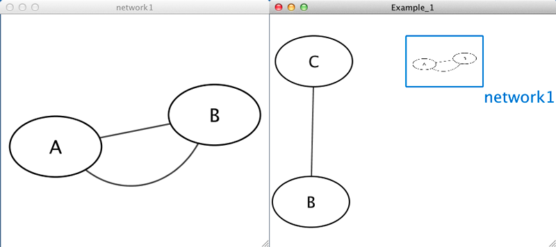
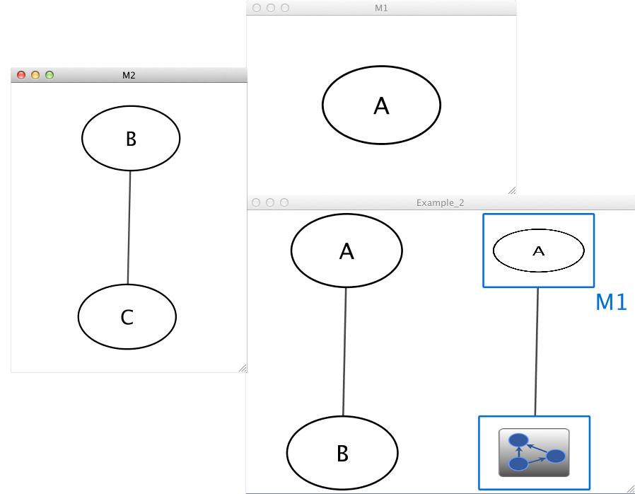
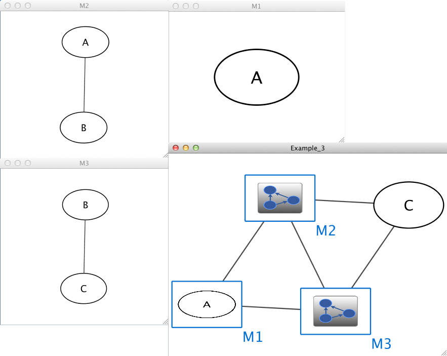
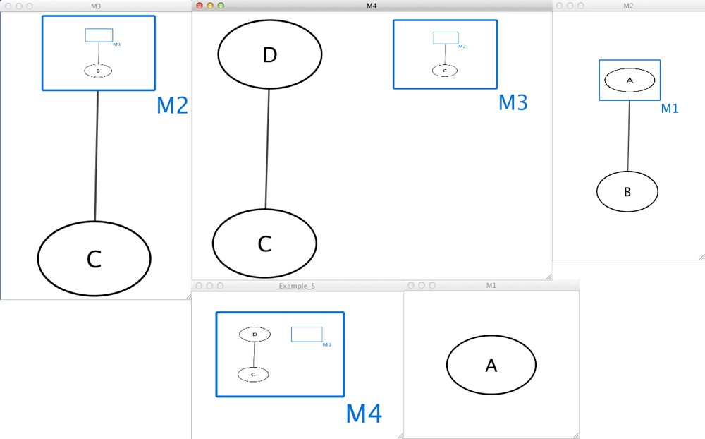
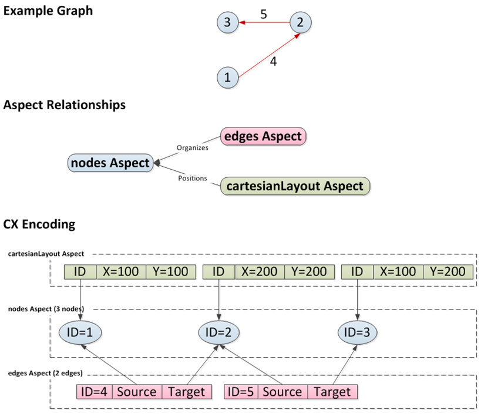

Supported Network File Formats
========================================

Cytoscape can read network/pathway files written in the following
formats:

-   Simple interaction file (SIF or .sif format)

-   Delimited text

-   Excel Workbook (.xls, .xlsx)

-   [Cytoscape CX Version 2](https://cytoscape.org/cx/cx2/specification/cytoscape-exchange-format-specification-(version-2)/)    

The SIF format specifies nodes and interactions only, while other
formats store additional information about network layout and allow
network data exchange with a variety of other network programs and data
sources. Typically, SIF files are used to import interactions when
building a network for the first time, since they are easy to create in
a text editor or spreadsheet. Once the interactions have been loaded and
network layout has been performed, the network may be saved to GML or
XGMML format for interaction with other systems. All file types listed
(except Excel) are text files and you can edit and view them in a
regular text editor.

## SIF Format

The simple interaction format is convenient for building a graph from a
list of interactions. It also makes it easy to combine different
interaction sets into a larger network, or add new interactions to an
existing data set. The main disadvantage is that this format does not
include any layout information, forcing Cytoscape to re-compute a new
layout of the network each time it is loaded.

Lines in the SIF file specify a source node, a relationship type (or
edge type), and one or more target nodes:

    nodeA <relationship type> nodeB
    nodeC <relationship type> nodeA
    nodeD <relationship type> nodeE nodeF nodeB
    nodeG
    ...
    nodeY <relationship type> nodeZ

A more specific example is:

    node1 typeA node2
    node2 typeB node3 node4 node5
    node0

The first line identifies two nodes, called node1 and node2, and a
single relationship between node1 and node2 of type typeA. The second
line specifies three new nodes, node3, node4, and node5; here "node2"
refers to the same node as in the first line. The second line also
specifies three relationships, all of type typeB and with node2 as the
source, with node3, node4, and node5 as the targets. This second form is
simply shorthand for specifying multiple relationships of the same type
with the same source node. The third line indicates how to specify a
node that has no relationships with other nodes. This form is not needed
for nodes that do have relationships, since the specification of the
relationship implicitly identifies the nodes as well.

Duplicate entries are ignored. Multiple edges between the same nodes
must have different edge types. For example, the following specifies two
edges between the same pair of nodes, one of type xx and one of type yy:

    node1 xx node2
    node1 xx node2
    node1 yy node2

Edges connecting a node to itself (self-edges) are also allowed:

    node1 xx node1

Every node and edge in Cytoscape has a name column. For a network
defined in SIF format, node names should be unique, as identically named
nodes will be treated as identical nodes. The name of each node will be
the name in this file by default (unless another string is mapped to
display on the node using styles). This is discussed in the section on
**[Styles](Styles.html#styles)**.
The name of each edge will be formed from the name of the source and
target nodes plus the interaction type: for example,
`sourceName (edgeType) targetName`.

The tag "edgeType" can be any string. Whole words or concatenated
words may be used to define types of relationships, e.g. geneFusion,
cogInference, pullsDown, activates, degrades, inactivates, inhibits,
phosphorylates, upRegulates, etc.

Some common interaction types used in the Systems Biology community are
as follows:

      pp .................. protein - protein interaction
      pd .................. protein -> DNA
      (e.g. transcription factor binding upstream of a regulating gene.)

Some less common interaction types used are:

      pr .................. protein -> reaction
      rc .................. reaction -> compound
      cr .................. compound -> reaction
      gl .................. genetic lethal relationship
      pm .................. protein-metabolite interaction
      mp .................. metabolite-protein interaction

### Delimiters

Whitespace (space or tab) is used to delimit the names in the simple
interaction file format. However, in some cases spaces are desired in a
node name or edge type. The standard is that, if the file contains any
tab characters, then tabs are used to delimit the fields and spaces are
considered part of the name. If the file contains no tabs, then any
spaces are delimiters that separate names (and names cannot contain
spaces).

If your network unexpectedly contains no edges and node names that look
like edge names, it probably means your file contains a stray tab that's
fooling the parser. On the other hand, if your network has nodes whose
names are half of a full name, then you probably meant to use tabs to
separate node names with spaces.

Networks in simple interactions format are often stored in files with a
`.sif` extension, and Cytoscape recognizes this extension when browsing
a directory for files of this type.

### Examples

#### Example 1

    Example_1      C
    Example_1      network1
    network1       A        pp        B
    network1       B        pp        A
    Example_1      C        pp        B

#### Example 2

    Example_2      M1
    Example_2      M2
    M1             A
    M2             B        pp        C
    Example_2      A        pp        B
    Example_2      M1       im        M2

#### Example 3

    Example_3      M1       im        M2
    Example_3      M3       im        M1
    Example_3      M2       im        M3
    Example_3      C        pp        M3
    Example_3      M2       pp        C
    M1             A
    M2             A        pp        B
    M3             B        pp        C

#### Example 4

    Example_4      M4
    M4             D
    M4             M3
    M3             M2        pp        C
    M2             M1        pp        B
    M1             A
    M4             C         pp        D

todo
