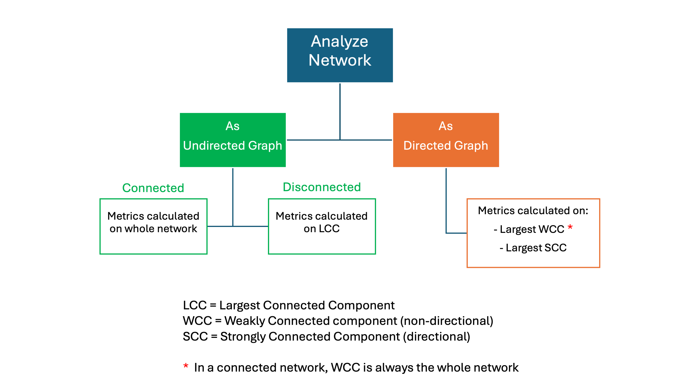

Analyze Network
====================

Cytoscape Web offers a network analyzer tool, the **NetworkX Analyzer (NXA)**, that can be accessed via **Tools → Analyze Network**.
The user interface consists of a dialog window with information about the tool and the option to choose whether to analyze your network as an undirected or directed graph.
The user experience is very similar to that of the Cytoscape desktop application and will be familiar to Cytoscape users.

As suggested by its name, NXA is based on the popular [NetworkX](https://networkx.org/documentation/stable/index.html) Python utility and provides a comprehensive suite of [analysis metrics](analyze.md#nxa_metrics) that can be used to annotate a network's elements.

## Network Components

When a network is disconnected, the analysis is usually performed on the largest connected component, in order to provide reliable metrics. The flowchart below illustrates how the metrics are calculated in directed vs undirected, as well as connected vs disconnected networks.

- **Largest Connected Component (LCC)** is defined as the connected component that contains the most nodes in the graph.
- **Strongly Connected Component (SCC)** is defined as a maximal set of nodes where each node is reachable from every other via directed paths.
- **Weakly Connected Component (WCC)** is defined as a maximal set of nodes that are connected if you ignore edge directions.

So, SCC metrics ***preserve*** directionality while WCC metrics ***ignore*** it.

For networks analyzed as **undirected graphs** (default option), if fully connected, the metrics are computed on the whole network. Instead, if the graph is disconnected, calculations are performed on the Largest Connected Component, and the attribute names will contain the **(LCC)** suffix.

For networks analyzed as **directed graphs**, regardless whether they are disconnected or not, the metrics are always calculated both on the largest Strongly Connected Component and the largest Weakly Connected Component, and the attribute names will contain the **(SCC)** and **(WCC)** suffixes respectively.

In a fully connected network, you will always have **only one WCC** spanning the entire graph (red asterisk), and several smaller SCCs, unless a large fraction of the edges come in reciprocal (bi-directional) pairs.

When analyzing a network as a directed graph, users are likely to be interested in preserving the causality of the relationships between nodes, but might also be interested in analyzing the overall structure of the network; by providing both SCC and WCC metrics, we ensure users obtain a thorough analysis of their networks.

For more information about graph components please refer to the relevant [NetworX documentation](https://networkx.org/documentation/stable/reference/algorithms/component.html)

## NXA Metrics

Below you'll find a comprehensive list of metrics computed by the analyzer. All metrics are added as new attributes to the NETWORK, NODE and EDGE tables with the appropriate component suffixes if applicable.

### Network-level Metrics

- **Number of Nodes**
- **Number of Edges**
- **Avg. Unique Neighbors**  
  Calculates the average number of unique neighbors in the network. Relies on [`DiGraph.successors()`](https://networkx.org/documentation/stable/reference/classes/generated/networkx.DiGraph.successors.html) and/or [`Graph.neighbors()`](https://networkx.org/documentation/stable/reference/classes/generated/networkx.Graph.neighbors.html)
- **LCC/SCC/WCC Nodes**  
  Calculates the number of nodes in the relevant largest component used for analysis.
- **LCC/SCC/WCC Node Coverage**  
  Calculates the node coverage (%) in the relevant largest component used for analysis.
- **Avg. Degree**  
  Calculates the average degree of the nodes in the network. In directed networks, calculates average In-Degree and Out-Degree. Relies on [`Graph.degree()`](https://networkx.org/documentation/stable/reference/classes/generated/networkx.Graph.degree.html), [`DiGraph.in_degree()`](https://networkx.org/documentation/stable/reference/classes/generated/networkx.DiGraph.in_degree.html) and [`DiGraph.out_degree()`](https://networkx.org/documentation/stable/reference/classes/generated/networkx.DiGraph.out_degree.html).
- **Network Diameter**  
  Calculates the diameter of the network, expressed as maximum eccentricity. Relies on [`eccentricity()`](https://networkx.org/documentation/stable/reference/algorithms/generated/networkx.algorithms.distance_measures.eccentricity.html)
- **Network Radius**  
  Calculates the radius of the network, expressed as the minimum eccentricity. 
- **Characteristic Path Lenght**  
  Measures the average shortest-path distance between all pairs of nodes in the network. Relies on [`shortest_path_length()`](https://networkx.org/documentation/stable/reference/algorithms/generated/networkx.algorithms.shortest_paths.generic.shortest_path_length.html)
- **Avg. Clustering Coefficient**  
  Computes the mean of all nodes clustering coefficients, reflecting the overall tendency of nodes to form tightly knit groups (triangles). Relies on [`clustering()`](https://networkx.org/documentation/stable/reference/algorithms/generated/networkx.algorithms.cluster.clustering.html).
- **Transitivity**  
  Computes the fraction of all possible triangles present in the network, as identified by the number of “triads” (two edges with a shared vertex). Relies on [`transitivity()`](https://networkx.org/documentation/stable/reference/algorithms/generated/networkx.algorithms.cluster.transitivity.html).
- **Network Density**  
  Measures the ratio of the number of actual edges in the network to the maximum possible number of edges.
- **Network Heterogeneity**  
  Calculates the coefficient of variation of node degrees, a measure of how unevenly connections are distributed among nodes in the network.
- **Network Centralization**  
  A measure of how much the network’s connections are concentrated on a few nodes (hubs), indicating whether the structure is star-like (high concentration) or more evenly spread (low concentration).
- **Connected Components (LCC/WCC/SCC)**  
  Counts the number of the relevant connected components. See **[Network Components](analyze.md#components)** above for more information on connected components.

### Node-level Metrics

- **Avg. Shortest Path Lenght**  
  Measures the average value of the shortest-path distances from a given node to all other reachable nodes in the network. Uses `shortest_path_lenght()` like Carachteristic Path Length network metric above.
- **Betweenness Centrality**  
  Calculates the sum of the fraction of all-pairs shortest paths that pass through a given node. Uses [`betweenness_centrality`](https://networkx.org/documentation/stable/reference/algorithms/generated/networkx.algorithms.centrality.betweenness_centrality.html).
- **Closeness Centrality**  
  Computes the reciprocal of the average shortest path distance to a given node over all n-1 reachable nodes. Relies on [`closeness_centrality()`](https://networkx.org/documentation/stable/reference/algorithms/generated/networkx.algorithms.centrality.closeness_centrality.html).
- **Clustering Coefficient**  
  Measures how likely a node’s neighbors are to form a tightly knit group (triangle), based on the ratio of actual to possible connections among them. Uses `clustering()` like Avg. Clustering Coefficient network metric above.
- **Degree Centrality**  
  Measures the fraction of nodes a given node is connected to. Uses [`degree_centrality()`](https://networkx.org/documentation/stable/reference/algorithms/generated/networkx.algorithms.centrality.degree_centrality.html).
- **Degree**  
  Calculates the node degree or the in-degree and out-degree for directed networks. Uses `Graph.degree()`, `DiGraph.in_degree()` and `DiGraph.out_degree()` like Avg. Degree metric above.
- **Eccentricity**  
  Calculates the maximum shortest-path distance from a given node to any other node in the network. Relies on `eccentricity()` like Network Diameter and Network Radius above.
- **Eigenvector Centrality**  
  Computes the centrality for a node by adding the centrality of its predecessors. Uses [`eigenvector_centrality()`](https://networkx.org/documentation/stable/reference/algorithms/generated/networkx.algorithms.centrality.eigenvector_centrality.html).
- **Neighborhood Connectivity**  
  Computes the average degree of each node's neighbors, thus indicating how well connected they are. Relies on [`average_neighbor_degree()`](https://networkx.org/documentation/stable/reference/algorithms/generated/networkx.algorithms.assortativity.average_neighbor_degree.html).
- **Partner of Multi-edged Node Pairs**  
  Calculates the number of times a given node is part of a node pair connected by more than one edge.
- **Radiality**  
  A measure of how close a node is to all other nodes in the network, calculated based on the shortest path distances and the network’s diameter, with higher values indicating greater overall accessibility. Uses [`diameter`](https://networkx.org/documentation/stable/reference/algorithms/generated/networkx.algorithms.distance_measures.diameter.html) as well as `shortest_path_lenght()` like Avg. Shortest Path Lenght node metric above.
- Self Loops  
  Counts the number of self loops for each node (if any).
- **Stress**  
  Measures the total number of shortest paths between all node pairs that pass through the given node, reflecting its role in network flow. Outputs raw counts (like Cytoscape Desktop) and uses [`all_shortest_paths`](https://networkx.org/documentation/stable/reference/algorithms/generated/networkx.algorithms.shortest_paths.generic.all_shortest_paths.html).
- **Topological Coefficient**  
  Measures the average fraction of a node's neighbors that are also neighbors of each other, indicating the overlap in connections within its immediate neighborhood. On the largest SCC, also calculates the metric for predecessors only, successors only and mutual. Like Avg. Unique Neighbors above, it relies on `Graph.neighbors()`, `DiGraph.successors()` as well as [`DiGraph.predecessors`](https://networkx.org/documentation/stable/reference/classes/generated/networkx.DiGraph.predecessors.html).

### Edge-level Metrics

- **Edge Betweenness**  
  Measures the number of shortest paths between all pairs of nodes that pass through a given edge, indicating the edge’s importance in connecting different parts of the network. Uses [`edge_betweenness_centrality()`](https://networkx.org/documentation/stable/reference/algorithms/generated/networkx.algorithms.centrality.edge_betweenness_centrality.html).
 
## Current Limitations

NXA cannot be used to analyze hierarchical models that use the HCX format in Cytoscape web. 
