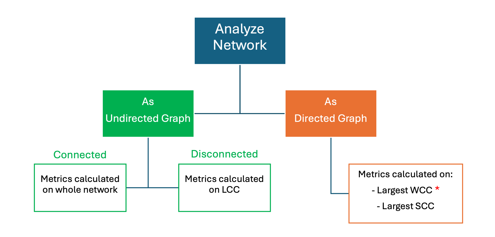

Analyze
====================

## Analyze Network

Cytoscape Web offers a network analyzer feature, the **NetworkX Analyzer (NXA)**, that can be accessed via **Tools → Analyze Network**.
The user interface consists of a dialog window with information about the tool and the option to choose whether to analyze your network as an undirected or directed graph.
The user experience is very similar to that of the Cytoscape desktop application and will be familiar to Cytoscape users.

As suggested by its name, NXA is based on the popular NetworkX Python utility and provides a comprehensive suite of analytic metrics 
that are appended to the network's NODE, EDGE and NETWORK tables as new attributes.

The flowchart below illustrates how the metrics are calculated in directed vs undirected, as well as connected vs 
disconnected networks.

### Basic Operations

-    With the buttons select either **UNION**, **INTERSECTION** or **DIFFERENCE**.

-    All the networks available to merge are listed under **Available Networks**.
     Select 2 or more networks from this list and click the right arrow to transfer
     them to **Networks to Merge**. The first network is marked with a yellow star and is the base network; the other network will 
     be merged into the base network.
     
-    Click **Merge** to continue. The merged network will be displayed as a new network in your workspace.

### Advanced Options
